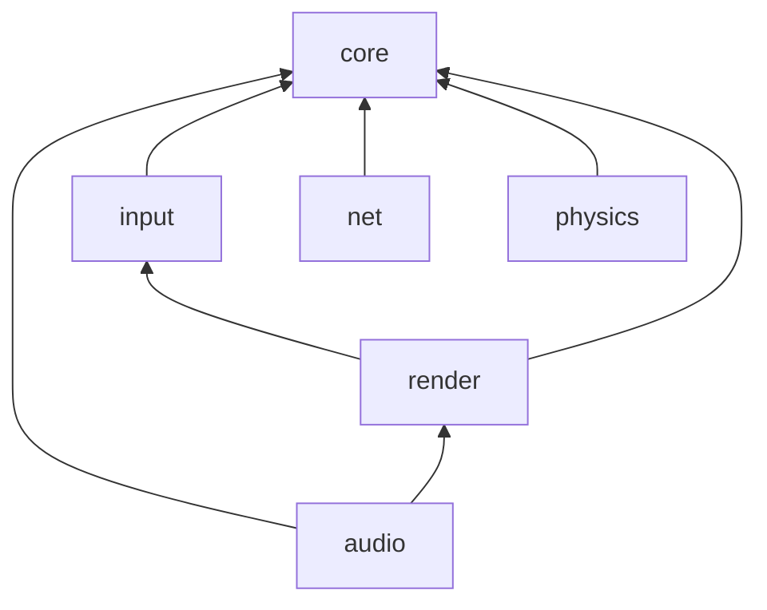

# Architecture

This section describes how the engine is organised.
For the reasons behind these choices, see [Design decisions](../decisions.md).

## Overview

The engine is made of two layers:

- **The ECS** (Entity Component System) is the engine's core data model. Game objects are entities, their data lives in components, and the logic lives in systems. See [ECS](ecs.md).
- **The modules** split the engine's features into separate libraries. Every module is built on top of `core`. See [Modules](modules.md).

## Module dependencies

`core` has no dependency on the other modules. The render module also depends on
input because its window event stream includes keyboard events. The audio module
depends on render, but render does not depend on audio.
